--- 
title: Labo 4 - Learning with Artificial Neural Networks
author: 
-        "Loïc Brasey"
-        "Bastien Pillonel"
date: \today
header-includes: |
    \usepackage[margin=2.5cm]{geometry}
    \usepackage[onehalfspacing]{setspace}
    \usepackage{fancyhdr}
    \pagestyle{fancy}
    \fancyhead[R]{HEIG-VD} 
    \fancyhead[L]{ARN} 
    \usepackage{setspace}
---

\pagebreak

## Question 1:

_What is the learning algorithm being used to optimize the weights of the neural
networks? What are the parameters (arguments) being used by that algorithm? What
cost function is being used ? please, give the equation(s)_

L'algorithm utilisé est le RMSprop de la librairie Keras.

Les paramètres utilisés sont :

```{python}
tf.keras.optimizers.RMSprop(
    learning_rate=0.001,
    rho=0.9,
    momentum=0.0,
    epsilon=1e-07,
    centered=False,
    weight_decay=None,
    clipnorm=None,
    clipvalue=None,
    global_clipnorm=None,
    use_ema=False,
    ema_momentum=0.99,
    ema_overwrite_frequency=100,
    jit_compile=True,
    name="RMSprop",
    **kwargs
)
```

L'equation utilisé est :

$v_{dw} = \beta * v_{dw} + (1 - \beta) * dw^2$   
$v_{db} = \beta * v_{dw} + (1 - \beta) * db^2$    
$W = W - a * \frac {dw} {\sqrt {v_{dw}} + \epsilon}$      
$b = b - a * \frac {db} {\sqrt {v_{db}} + \epsilon}$    

Selon article de site web [towardsdatascience](https://towardsdatascience.com/a-look-at-gradient-descent-and-rmsprop-optimizers-f77d483ef08b)

Et la loss function utilisé est la [categorical_crossentropy](https://keras.io/api/losses/probabilistic_losses/#categoricalcrossentropy-class).

## Question 2

_Model complexity: for each experiment (shallow network learning from raw data, shallow
network learning from features, CNN, and Fashion MNIST), select a neural network
topology and describe the inputs, indicate how many are they, and how many outputs.
Compute the number of weights of each model (e.g., how many weights between the
input and the hidden layer, how many weights between each pair of layers, biases, etc..)
and explain how do you get to the total number of weights._

_**Pour commencer nous avons garder les modèles de base de chaque notebook.**_

### Shallow network learning from raw data
Nbr d'entrés : 784\
Nbr de sorties : 10 classes\
Nbr de couches cachée : 1\
Nbr de neurones cachés : 300\
Nbr de poids dans couche caché : 784 * 300 + 300 = 235 500
Nbr de poids à la sortie : 300 * 10 + 10 = 3010

Nbr de poids total : 235 500 + 3010 = 238 510 

### Shallow network learning from features
Nbr d'entrés : 392\
Nbr de sorties : 10 classes\
Nbr de couches cachée : 1\
Nbr de neurones cachés : 200\
Nbr de poids dans couche caché : 392 * 200 + 200 = 78'600
Nbr de poids à la sortie : 200 * 10 + 10 = 2'010

Nbr de poids total :78'600 + 2'010 = 80'610

### CNN
Nbr de poids Layer 1 : (Conv2D) 9 * 25 + 9 = 234 
Nbr de poids Layer 2 : (Conv2D) 9^2 * 25 + 9 = 2034
Nbr de poids Layer 3 : (Conv2D) 16 * 9^2 + 16 = 1312
Nbr de poids Layer 4 : (Dense)  25 * 144 + 25 = 3625
Nbr de poids Layer 5 : (Dense)  10 * 25 + 10 = 260

Nbr de poids total : 234 + 2034 + 1312 + 3625 +260 = 7465

### Fashion MNIST

## Question 3

_Do the deep neural networks have much more “capacity” (i.e., do they have more
weights?) than the shallow ones? explain with one example_

Oui les réseaux profonds ont plus de capacité car ils sont plus efficaces en terme de nombre de poids. Comme vu au point numéro 2, les 2 réseaux shallow ont beaucoup plus de poid que le réseau convolutionnel. => Moins de poid permet de traiter plus rapidement une époch.


## Question 4

_Test every notebook for at least three different meaningful cases (e.g., for the MLP
exploiting raw data, test different models varying the number of hidden neurons, for the
feature-based model, test pix_p_cell 4 and 7, and number of orientations or number of
hidden neurons, for the CNN, try different number of neurons in the feed-forward part)
describe the model and present the performance of the system (e.g., plot of the
evolution of the error, final evaluation scores and confusion matrices). Comment the
differences in results. Are there particular digits that are frequently confused?_

### Shallow network learning from raw data

Pour ce notebook nous avons principalement essayé de faire varier le nombre de neurones dans la couches cachée.

**Résultat avec 100 neurones:**

\center
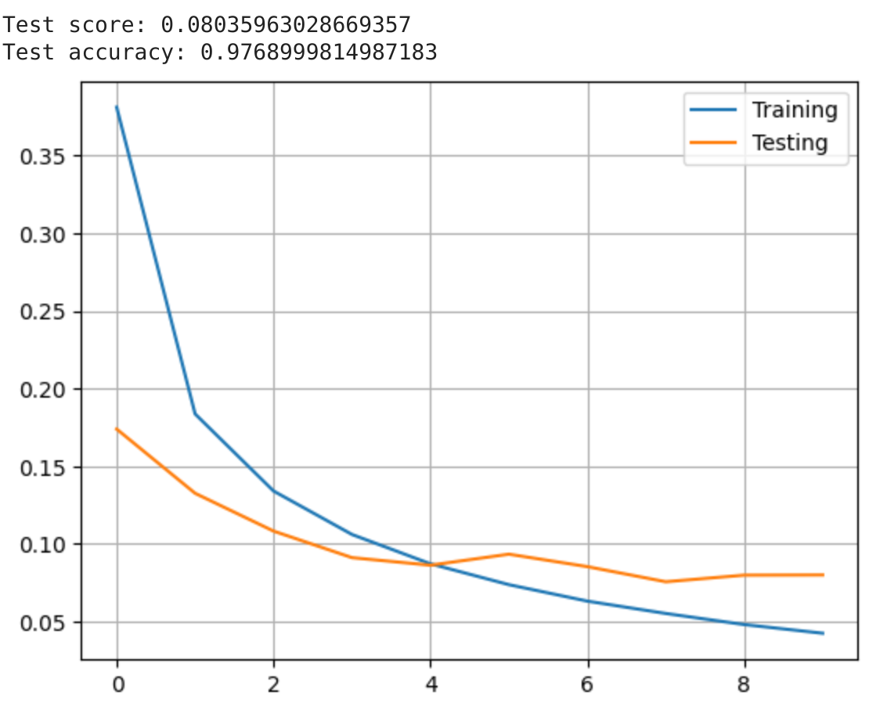{ width=60% }
\center

\center
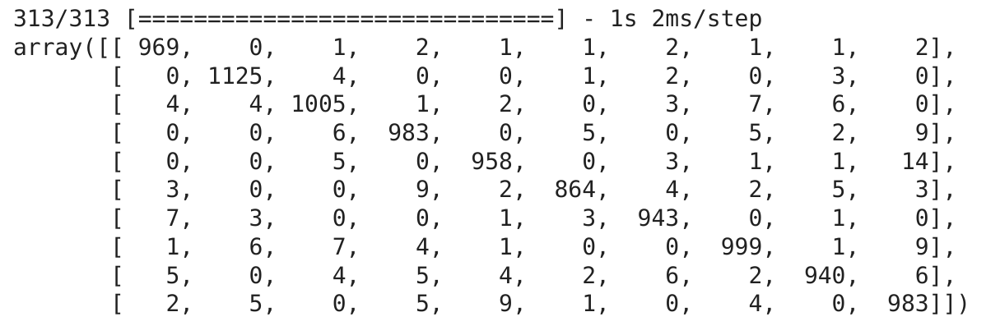{ width=60% }
\center

**Résultat avec 200 neurones:**

\center
{ width=60% }
\center

\center
{ width=60% }
\center

**Résultat avec 400 neurones:**

\center
{ width=60% }
\center

\center
{ width=60% }
\center

**Résultat avec 800 neurones:**

\center
{ width=60% }
\center

\center
{ width=60% }
\center

\raggedright
**Interprétation des résultats:**

A partir de 400 neurones, on commence à observer un overfitting du modèle. Encore plus présent pour une couche cachée possèdant 800 neurones (l'erreur de la courbe de test commence à remonter après plusieurs epochs).

Pour ce cas-ci 200 neurones semble être un bon nombre de neurones.

### Shallow network learning from features
Ici l'augmentation des neurones n'améliore pas l'entraînement du modèle passé les 200 neurones. Nous avons ensuite choisit aléatoirement diverse valeur de pixel_p_cell et d'orientation.

**Résultat avec 4 pixel_p_cell, 20 d'orientation et 100 neurones:**

\center
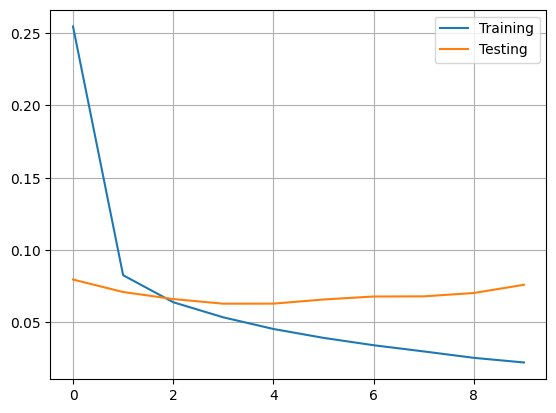{ width=60% }
\center

**Résultat avec 2 pixel_p_cell, 12 d'orientation et 200 neurones:**

\center
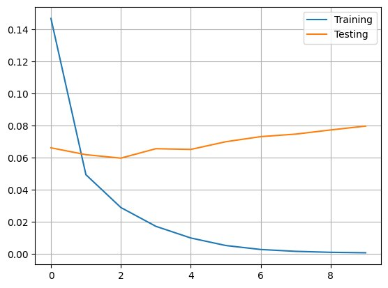{ width=60% }
\center

**Résultat avec 7 pixel_p_cell, 21 d'orientation et 200 neurones:**

\center
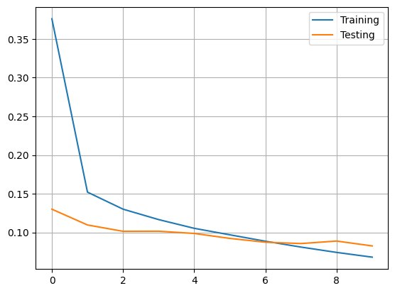{ width=60% }
\center

**Résultat avec 7 pixel_p_cell, 64 d'orientation et 200 neurones:**

\center
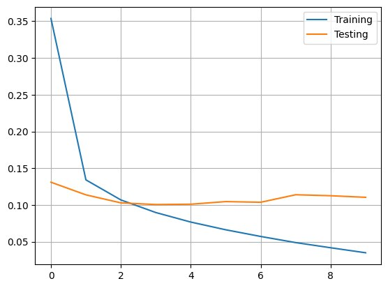{ width=60% }
\center

\raggedright
**Interprétation des résultats:**
Après plusieurs essaies, on voit que la configuration 7 pixel par cell, avec une orientation à 21 et un nombre de neurones à 200 obtient les meilleures résultats avec une courbe de test assez proche de la courbe de training.

### CNN
Pour cette partie il était indiqué dans la donnée de principalement changé le nombre de neurones dans la couches caché. Nous avons tout de même essayer de varier le nombre d'épochs. Ceci n'a juste fait qu'augementer l'overfitting. Puis nous avons essayer de changer les dimensions des filtres de convolution et du pooling mais cela n'a pas eu d'impact positif sur l'entraînement du modèle.

Nous allons donc uniquement nous concentrer sur la variation du nombre de neurones dans la couche caché.


**Résultat avec 25 neurones:**

\center
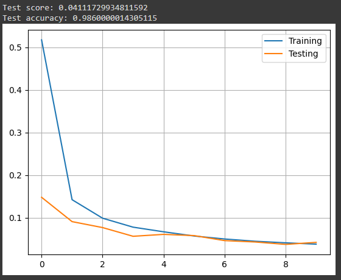{ width=60% }
\center

\center
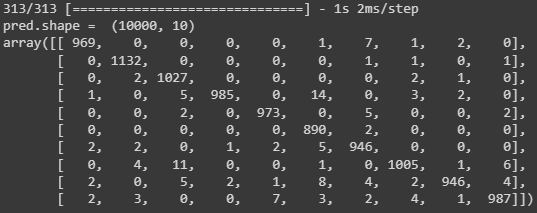{ width=60% }
\center

**Résultat avec 100 neurones:**

\center
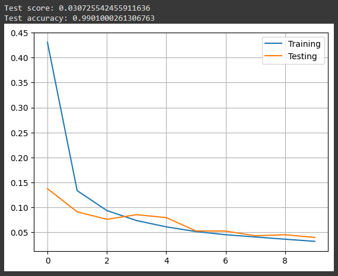{ width=60% }
\center

\center
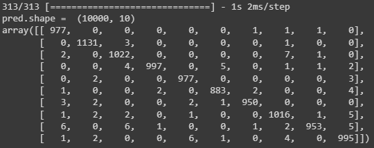{ width=60% }
\center

**Résultat avec 200 neurones:**

\center
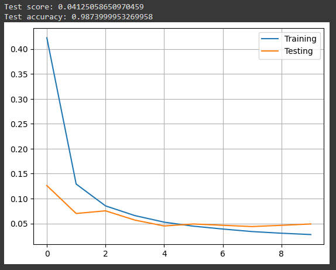{ width=60% }
\center

\center
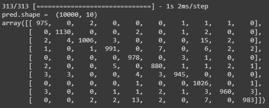{ width=60% }
\center

**Résultat avec 400 neurones:**

\center
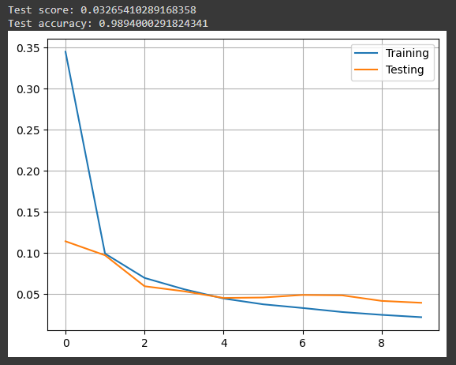{ width=60% }
\center

\center
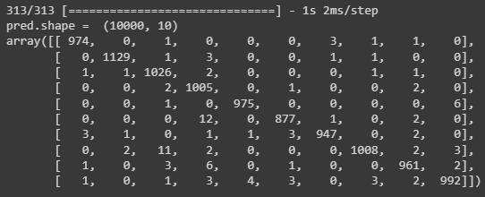{ width=60% }
\center

\raggedright
**Interprétation des résultats:**
Ici nous observons un résultat optimal pour 100 neurones => accuracy proche de 1. Pour 200 et 400, on observe de l'overfitting nous choisirons donc 100 neurones.


## Question 5

_Train a CNN to solve the MNIST Fashion problem, present your evolution of the errors
during training and perform a test. Present a confusion matrix, accuracy, F-score and
discuss your results. Are there particular fashion categories that are frequently
confused?_

Pour cette dernière partie nous avons augmenter le nombre d'epoch à 20 pour être sûr que le model aie le temps de converger.

Aussi nous avons essayer plusieurs architectures différentes avant de tomber sur celle présente dans le notebook (2 x conv2d + 2 x Dense).

\center
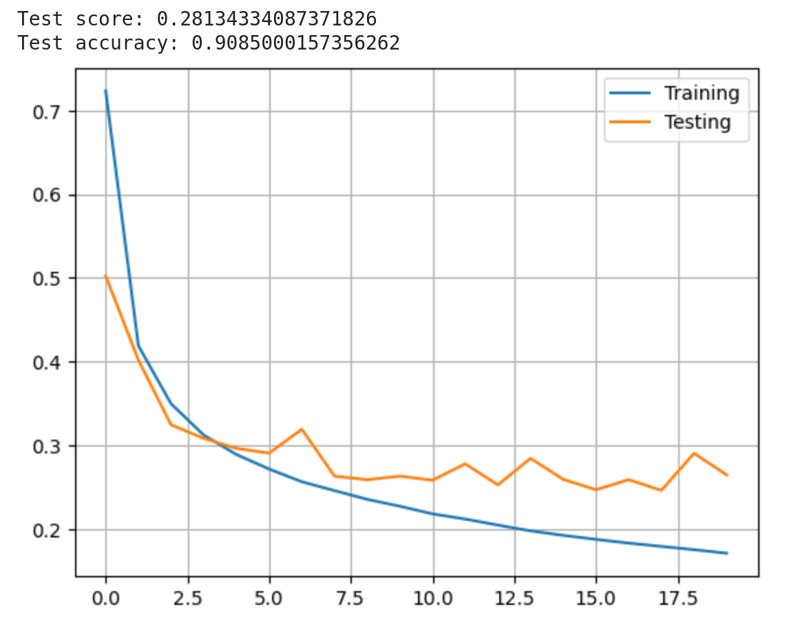{ width=60% }
\center

\center
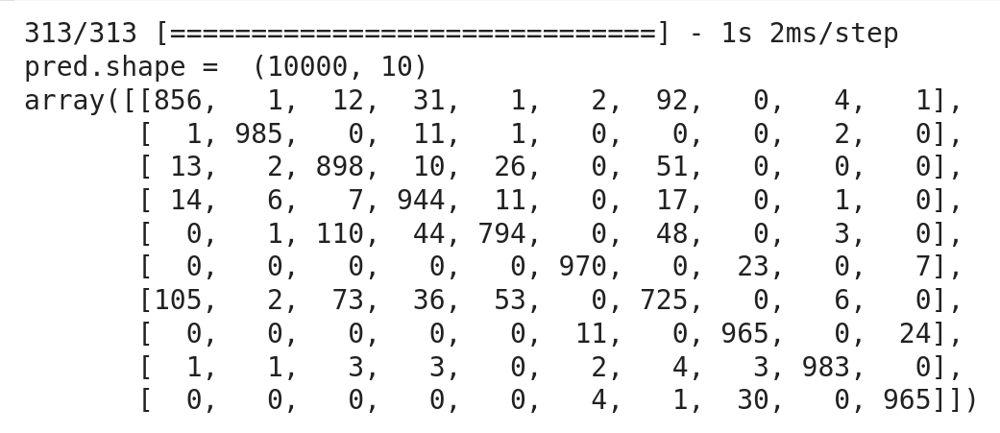{ width=60% }
\center


\raggedright
**Interprétation des résultats:** 
Malgré de nombreuse tentative, le model a de la peine à dépasser les 90% d'accuracy.  
On peut voir dans la matrice de confusion que il y a 3-4 classes particulièrement difficile à discerner.   
Certes avec plus de neurone, on peut réduire cette erreur. Toute fois, elle est loin d'être proportionnel, il faut de plus en plus de neurones pour réduire de moins en moins l'erreur.  
Il est sûrement plus intéressant de chercher d'autre méthode que le filtre de convolution pour extraire de nouvelles caractéristiques pour chaque image afin d'aider le model à mieux répartir chaque image.